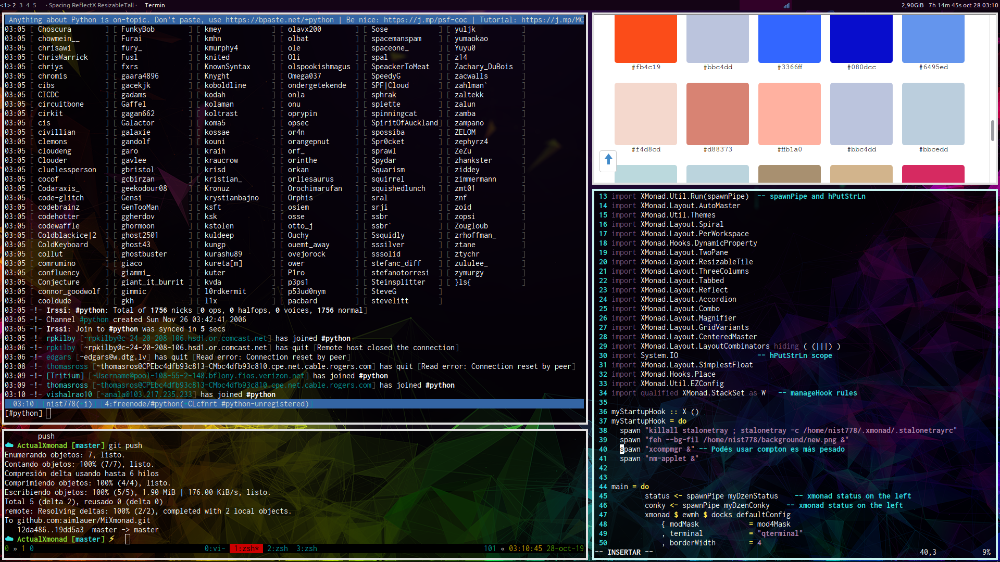

**Dependencies**  
- xmonad 0.15
- qterminal
- feh
- xcompmgr
- nm-applet
- stalonetray
- dmenu (dmenu_run)
- dzen2
- conky

**Installation**  
1. `sudo pacman -S qterminal feh xcompmgr network-manager-applet stalonetray dmenu dzen2 conky`
2. `git clone https://github.com/aimlauer/MiXmonad ~/.xmonad`
3. `xmonad --recompile`
